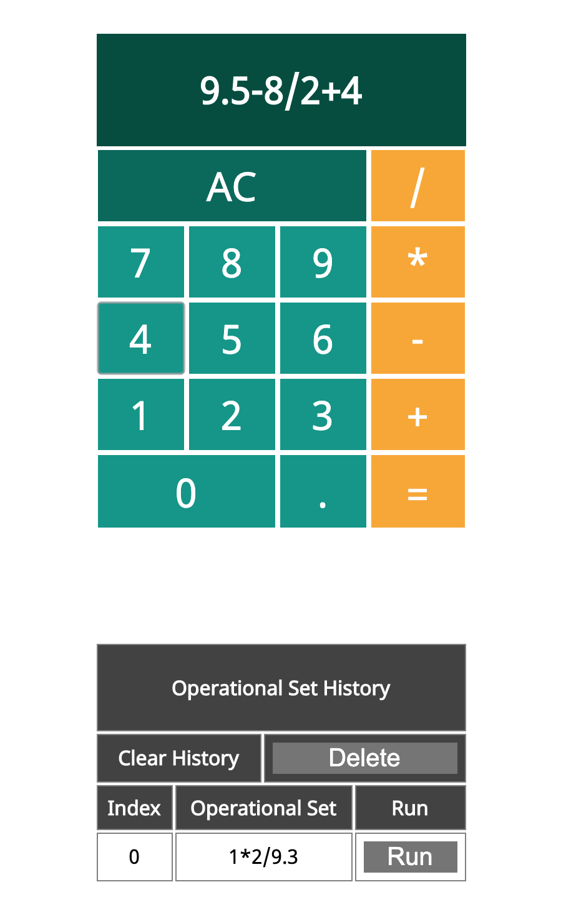

# Project Name

[Project Instructions](./INSTRUCTIONS.md), this line may be removed once you have updated the README.md

## Description

The project scope outlined a browser-compatible calculator capable of storing an operational set history. This calculator allows the user to easily search for a previously entered operation and initiate a run without the need for additional key strokes or mouse clicks.

The project build tasks included:

1. Interface Design of Calculator

   [ ac ][ / ]
   [ 7 ][ 8 ][ 9 ][ * ]
   [ 4 ][ 5 ][ 6 ][ + ]
   [ 1 ][ 2 ][ 3 ][ - ]
   [ 0 ][ . ][ = ]

2. Table Layout for Opertaional Set History

   Title > Clear > Delete Button > Index > Set > Run > ---- Index > x + y > Run Button

3. Process Steps for the Client Side Set-up

   Interface > User Validation > Input Values > Object > AJAX POST > AJAX GET > Display on DOM.

4. Server Side Set-up

   POST > Logic for Calculator > Add to Existing Server Data > GET > Render to DOM

5. Logic for Calculator Input

   Split Input String > New Array w/Split Values > Calculate Operational Set > Render to Calculator Display

6. Added a Delete and Operational Set Run Fucntions.

7. Added CSS Styles to Tables and Utilized Materialize CSS for Colors Scheme.

## Screen Shot

## Usage

User Experience:

1. User enters an operational set into the virtual calculator on the DOM.
2. Operations can be chained together and calculated with the '=' button used only once.
3. The operational set shows up in the history table.
4. The user can find previous sets and get the value by using the run button.
5. A delete button was added the history component to delete all previous operational sets.

## Built With

1. Node.js
2. Express
3. jQuery
4. CSS / HTML
